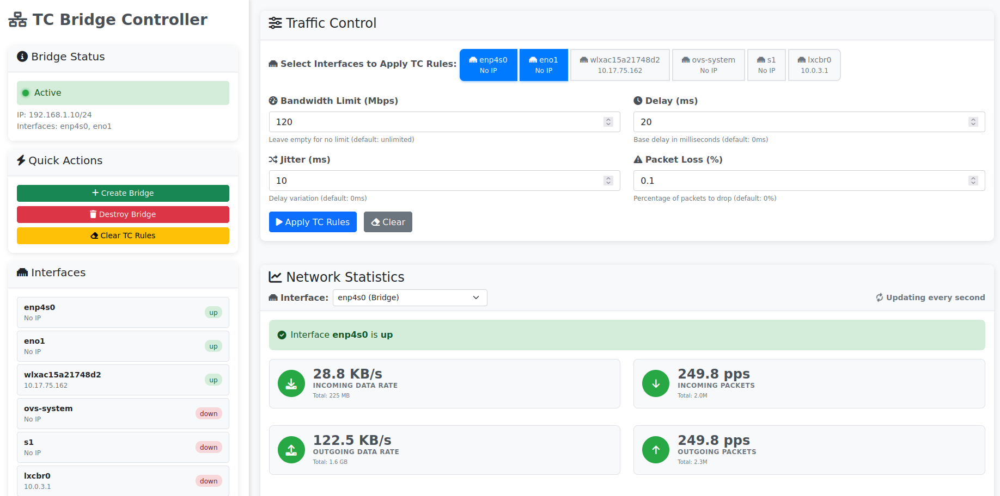

# TC Bridge Controller

A modern web-based UI for managing network bridges with traffic control (tc) functionality. This application allows you to easily create network bridges between computers and apply various network conditions like delay, jitter, packet loss, and bandwidth limiting.

## Features

- **Network Bridge Management**: Create and destroy network bridges with a simple interface
- **Traffic Control**: Apply tc rules for:
  - Bandwidth limiting
  - Network delay
  - Jitter (delay variation)
  - Packet loss simulation
- **Real-time Monitoring**: Live status updates and network statistics
- **Per-Interface Statistics**: Select any interface to view detailed real-time stats
- **Interface Selector**: Choose which interface to monitor with rates (B/s, pps)
- **Modern UI**: Clean, responsive web interface with color-coded statistics
- **Interface Selection**: Easy selection of network interfaces for bridge creation
- **Bridge Persistence**: Automatically detects existing bridges on startup

## Requirements

- Python 3.7+
- Linux system with root privileges (for tc and ip commands)
- Network interfaces to bridge

## Installation

1. **Clone or download the project**:
   ```bash
   cd tc-bridge-controler
   ```

2. **Install Python dependencies**:
   ```bash
   pip install -r requirements.txt
   ```

3. **Run the application** (requires root privileges):
   ```bash
   sudo python3 app.py
   ```

4. **Access the web interface**:
   Open your browser and navigate to `http://localhost:5000`

## Screenshot



*The main interface showing bridge status, traffic control settings, and real-time network statistics with interface selector.*

## Usage

### Creating a Bridge

1. Click the "Create Bridge" button in the sidebar
2. Select the network interfaces you want to bridge
3. Click "Create Bridge" to confirm
4. The bridge will be created with IP address `192.168.1.10/24`

### Applying Traffic Control Rules

1. Select the interfaces you want to apply TC rules to using the interface tabs
2. Fill in the desired parameters in the Traffic Control panel:
   - **Bandwidth Limit**: Set maximum bandwidth in Mbps (default: unlimited)
   - **Delay**: Add network delay in milliseconds (default: 0ms)
   - **Jitter**: Add delay variation in milliseconds (default: 0ms)
   - **Packet Loss**: Simulate packet loss as a percentage (default: 0%)

3. Click "Apply TC Rules" to apply the settings

### Monitoring Network Statistics

1. Use the interface selector dropdown to choose which interface to monitor
2. View real-time statistics including:
   - **Incoming/Outgoing Data Rates**: Bytes per second with totals
   - **Incoming/Outgoing Packet Rates**: Packets per second with totals
   - **Total Throughput**: Combined data and packet rates
   - **Error Rate**: Percentage of errors with total count
3. Statistics update every second automatically

### Managing the Bridge

- **Destroy Bridge**: Removes the bridge and restores original interface configuration
- **Clear TC Rules**: Removes all traffic control rules from selected interfaces
- **Clear Form**: Clears the traffic control form (keeps interface selections)

## Network Interface Examples

Based on your script, you might have interfaces like:
- `eno1` - First Ethernet interface
- `enp4s0` - Second Ethernet interface

The application will automatically detect available interfaces and display them for selection.

## Traffic Control Examples

### Simulate Slow Network
- Bandwidth: 10 Mbps
- Delay: 100ms
- Jitter: 20ms
- Packet Loss: 2%

### Simulate Poor Network
- Bandwidth: 1 Mbps
- Delay: 500ms
- Jitter: 100ms
- Packet Loss: 10%

### Simulate Good Network
- Bandwidth: 100 Mbps
- Delay: 10ms
- Jitter: 5ms
- Packet Loss: 0%

## API Endpoints

The application provides REST API endpoints:

- `GET /api/interfaces` - Get available network interfaces
- `GET /api/bridge/status` - Get current bridge status
- `POST /api/bridge/create` - Create network bridge
- `POST /api/bridge/destroy` - Destroy network bridge
- `POST /api/tc/apply` - Apply traffic control rules
- `POST /api/tc/clear` - Clear traffic control rules
- `GET /api/tc/status/<interface>` - Get TC status for specific interface
- `GET /api/network/stats` - Get network statistics for all interfaces
- `GET /api/network/stats/<interface>` - Get detailed statistics for specific interface

## Security Notes

- The application requires root privileges to manage network interfaces and tc rules
- Only run this application on trusted networks
- The web interface is accessible to anyone who can reach the server

## Troubleshooting

### Permission Denied Errors
Make sure you're running the application with sudo:
```bash
sudo python3 app.py
```

### Interface Not Found
Check available interfaces:
```bash
ip addr show
```

### TC Rules Not Applied
Verify tc is available:
```bash
which tc
```

### Bridge Already Exists
The application will automatically remove existing bridges before creating new ones.

## Development

### Project Structure
```
tc-bridge-controler/
├── app.py              # Main Flask application
├── config.py           # Configuration settings
├── requirements.txt     # Python dependencies
├── start.sh            # Startup script
├── test_setup.py       # Environment test script
├── templates/
│   └── index.html      # Main HTML template
├── static/
│   ├── css/
│   │   └── style.css   # CSS styles
│   └── js/
│       └── app.js      # Frontend JavaScript
└── README.md           # This file
```

### Adding New Features

1. **Backend**: Add new routes in `app.py`
2. **Frontend**: Update JavaScript in `static/js/app.js`
3. **UI**: Modify HTML template in `templates/index.html`
4. **Styling**: Update CSS in `static/css/style.css`

## License

This project is open source and available under the MIT License.

## Contributing

Feel free to submit issues and enhancement requests! 